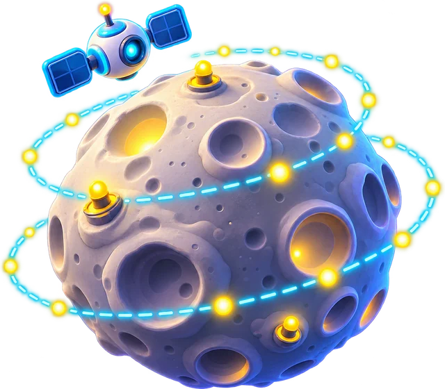
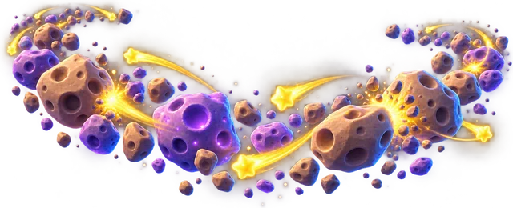
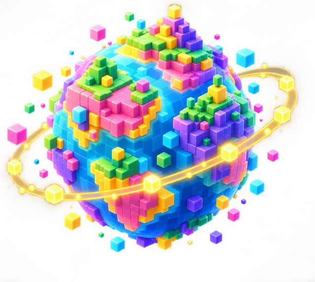
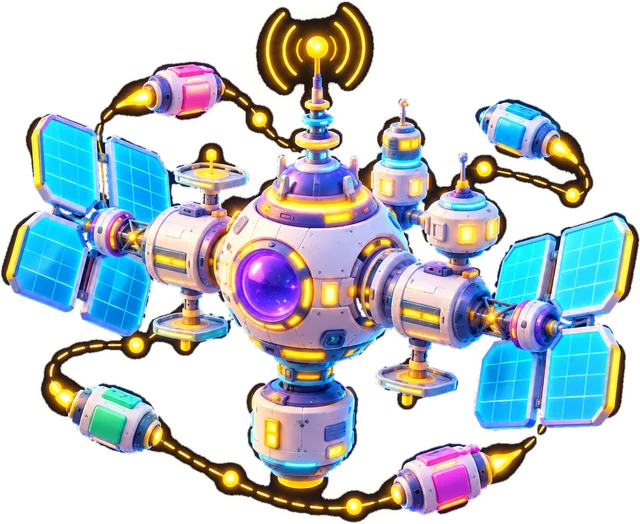
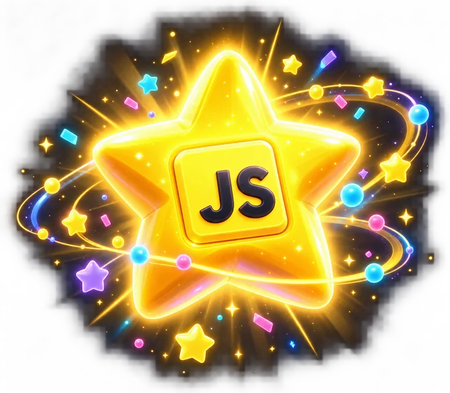

# 30 Günde JavaScript: müfredat

30 gün, 8 bölge. Maskot: **Kodi**. Her gün: kısa anlatım, çalıştırılabilir örnekler, 3 görev, isteğe bağlı challenge ve seçilen projeye bir adım.

## Proje yolları

- **Yıldız Avcısı** (varsayılan)
- **Kişisel Web Sitem** (Web): Tema değiştiren, galerisi ve iletişim formu olan, tamamen senin kodunla çalışan etkileşimli bir site.
- **Çalışma Asistanım** (Uygulama): Yapılacaklar listesi, odak zamanlayıcısı ve haftalık istatistikleri olan kişisel bir uygulama.
- **Bilgi Yarışması** (Yarışma): Süreli sorular, puan tablosu ve dışarıdan yüklenen soru paketleriyle bir bilgi yarışması.

## Günler

### Kalkış Üssü (Gün 1–4)

| Gün | Konu | Hedef | Proje katkısı |
|---|---|---|---|
| [1](gunler/gun-01.md) | JavaScript ile tanışma | console.log ile ekrana yazdırmak, yorum yazmak ve hata mesajı okumak | Oyunun açılış ekranı |
| [2](gunler/gun-02.md) | Değişkenler ve veri tipleri | let ve const ile değişken oluşturmak, metin/sayı/mantıksal değerleri tanımak | Oyuncunun verileri |
| [3](gunler/gun-03.md) | Operatörler ve Math | Aritmetik, karşılaştırma ve mantıksal operatörleri kullanmak; Math ile hesap yapmak | Skor hesabı |
| [4](gunler/gun-04.md) | Metinlerle çalışmak | Şablon metinlerle mesaj oluşturmak ve metin metotlarını kullanmak | Durum çubuğu |

### Döngü Ayı (Gün 5–8)

| Gün | Konu | Hedef | Proje katkısı |
|---|---|---|---|
| [5](gunler/gun-05.md) | Koşullar | if, else if, else, üçlü operatör ve switch ile karar vermek | Oyunun durumu |
| [6](gunler/gun-06.md) | Diziler | Dizi oluşturmak, elemanlara indeksle ulaşmak, eleman eklemek, çıkarmak ve aramak | Envanter listesi |
| [7](gunler/gun-07.md) | Döngüler | for, while ve for...of ile işleri tekrarlatmak, dizileri dolaşmak ve toplam biriktirmek | Düşman dalgaları |
| [8](gunler/gun-08.md) | Fonksiyonlar | Fonksiyon tanımlamak, parametre almak, return ile değer döndürmek ve varsayılan parametre kullanmak | Saldırı fonksiyonu |

### Fonksiyon Nebulası (Gün 9–12)

| Gün | Konu | Hedef | Proje katkısı |
|---|---|---|---|
| [9](gunler/gun-09.md) | Ok fonksiyonları ve kapsam | Ok fonksiyonu yazmak, kapsamı anlamak, fonksiyonları değer gibi kullanmak ve hatırlayan fonksiyonlar (closure) yapmak | Sayaç üreten fonksiyon |
| [10](gunler/gun-10.md) | Nesneler | Nesne oluşturmak, özelliklerini okuyup değiştirmek, metot yazmak ve nesne dizileriyle çalışmak | Oyuncu nesnesi |
| [11](gunler/gun-11.md) | map, filter, reduce | map, filter, reduce, find, some, every ve sort ile dizileri dönüştürmek, süzmek ve sıralamak | Skor tablosu |
| [12](gunler/gun-12.md) | Set, Map ve JSON | Set ile tekrarları ayıklamak, Map ile anahtar-değer tutmak, spread ile kopyalamak ve veriyi JSON'a çevirmek | Kayıt dosyası |

### DOM Gezegeni (Gün 13–16)

| Gün | Konu | Hedef | Proje katkısı |
|---|---|---|---|
| [13](gunler/gun-13.md) | DOM'a giriş | querySelector ile sayfadaki elemanları bulmak; metnini, sınıfını, stilini ve niteliklerini değiştirmek | Başlangıç ekranı |
| [14](gunler/gun-14.md) | Olaylar | addEventListener ile tıklama ve yazma olaylarını dinlemek, e.target ve olay yetkilendirmeyi kullanmak | Başla düğmesi |
| [15](gunler/gun-15.md) | Eleman oluşturmak | createElement ile yeni elemanlar oluşturmak, diziden liste çizmek (render), eleman silmek ve dataset kullanmak | Envanter listesi ekranda |
| [16](gunler/gun-16.md) | Formlar | Formdan değer okumak (metin, sayı, onay kutusu, seçim listesi), doğrulamak ve hataları sayfada göstermek | Pilot adı formu |

### Olay Kuşağı (Gün 17–20)

| Gün | Konu | Hedef | Proje katkısı |
|---|---|---|---|
| [17](gunler/gun-17.md) | Klavye ve ses | keydown/keyup ile tuşlara tepki vermek, bir elemanı klavyeyle hareket ettirmek ve Web Audio ile bip sesi çalmak | Klavye kontrolü ve sesler |
| [18](gunler/gun-18.md) | Zamanlayıcılar | setTimeout, setInterval ve clearInterval ile zamanlanmış işler yapmak, üst üste binen sayaçları önlemek | Süre sayacı |
| [19](gunler/gun-19.md) | CSS'i kodla kontrol etmek | style, classList, CSS değişkenleri ve data-* özellikleriyle görünüşü JavaScript'ten değiştirmek | Tema ve efektler |
| [20](gunler/gun-20.md) | Kalıcı veri | localStorage ile sayı, metin, dizi ve nesne saklamak; açılışta kayıtlı veriyi yükleyip varsayılan değer kullanmak | En yüksek skoru kaydetmek |

### Piksel Gezegeni (Gün 21–23)

| Gün | Konu | Hedef | Proje katkısı |
|---|---|---|---|
| [21](gunler/gun-21.md) | Canvas ile çizim | canvas üzerine dikdörtgen, daire ve çizgi çizmek; bir diziden döngüyle resim çizmek | Oyun alanını çizmek |
| [22](gunler/gun-22.md) | Animasyon | requestAnimationFrame ile animasyon döngüsü kurmak, update ve draw'u ayırmak, hız ve sekme hesaplamak | Gemi hareketi |
| [23](gunler/gun-23.md) | Oyun döngüsü | oyunun durumunu bir nesnede tutmak, dikdörtgen çarpışmasını hesaplamak, skor ve oyun bitti durumunu yönetmek | Çarpışma ve yıldız toplama |

### Async İstasyonu (Gün 24–27)

| Gün | Konu | Hedef | Proje katkısı |
|---|---|---|---|
| [24](gunler/gun-24.md) | Hatalar ve hata ayıklama | hata türlerini tanımak, try/catch/finally ile hataları yakalamak, throw ile kendi hatanı fırlatmak ve hata ayıklamak | Hataya dayanıklı oyun |
| [25](gunler/gun-25.md) | Promise ve async/await | Promise oluşturmak, then/catch ve async/await ile beklemek, hataları yakalamak ve Promise.all ile işleri birlikte yürütmek | Seviye yükleme |
| [26](gunler/gun-26.md) | fetch ve API | fetch ile bir API'den JSON veri almak, hataları yönetmek ve gelen veriyi sayfada göstermek | Seviyeleri sunucudan almak |
| [27](gunler/gun-27.md) | Sınıflar ve modüller | class ile nesne kalıpları yazmak; constructor, metot, getter, extends kullanmak ve modül fikrini anlamak | Gemi sınıfı |

### JavaScript Yıldızı (Gün 28–30)

| Gün | Konu | Hedef | Proje katkısı |
|---|---|---|---|
| [28](gunler/gun-28.md) | Temiz kod | Anlamlı isimler, küçük fonksiyonlar, sabitler, erken dönüş ve parçalama ile kodu düzenlemek | Kodu düzenlemek |
| [29](gunler/gun-29.md) | Projeyi toparlama | Düğme ve klavyeyi aynı fonksiyona bağlamak, erişilebilir kontroller yapmak ve kodu init/render/update ile düzenlemek | Mobil kontroller |
| [30](gunler/gun-30.md) | Final | Öğrendiklerini tek bir projede birleştirmek, projeni yayınlamayı ve sonraki adımları öğrenmek | Yayınla ve paylaş |
