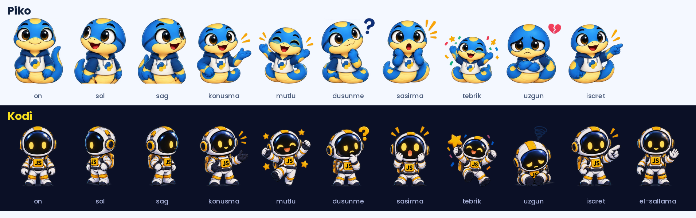

# Maskotlar

Aynı poz adları iki maskotta da aynı anlama gelir; video şablonu ve senaryolar bu adları kullanır.
Ayrıntılar ve "ne zaman kullanılır" açıklamaları: [pozlar.json](pozlar.json).

| Poz | Ne zaman |
|---|---|
| on | Önden duruş; nötr sunum |
| sol / sag | Ekranın bir yanındaki şeye bakar |
| konusma | Anlatım sahnelerinin varsayılanı |
| mutlu | Doğru cevap, güzel sonuç |
| dusunme | Soru sorarken, ipucu verirken |
| sasirma | Hata mesajı, beklenmedik sonuç |
| tebrik | Gün sonu, görev tamam |
| uzgun | Yaygın hata, yanlış cevap |
| isaret | Kod satırını ya da çıktıyı gösterirken |
| el-sallama | Açılış ve kapanış (yalnızca Kodi) |

## Piko (30 Günde Python)
- `piko-python/pozlar/`: 10 tam boy poz (şeffaf PNG)
- `piko-python/yuzler/`: dudak senkronu için yüz kareleri: `a`, `e`, `i`, `o`, `u` (sesli harf ağız şekilleri), `kapali`, `gulumseme`, `gulus`
- `piko-python/avatarlar/`: öğrenci profil avatarları (10 renk)

## Kodi (30 Günde JavaScript)
- `kodi-javascript/pozlar/`: 11 tam boy poz (şeffaf PNG, kayıpsız)
- `kodi-javascript/konusma-kareleri/`: 7 büst karesi; konuşurken ~8 kare/sn sırayla gösterilebilir
- `kodi-javascript/kahraman.png`: laptoplu, başparmak kaldıran büyük çizim (tanıtım sayfası, kapak)
- `kodi-javascript/kaynak/poz-sayfasi.png`: tüm pozların orijinal çizim sayfası
- Renkler: sarı `#F7DF1E`, lacivert `#0B1026`, beyaz
